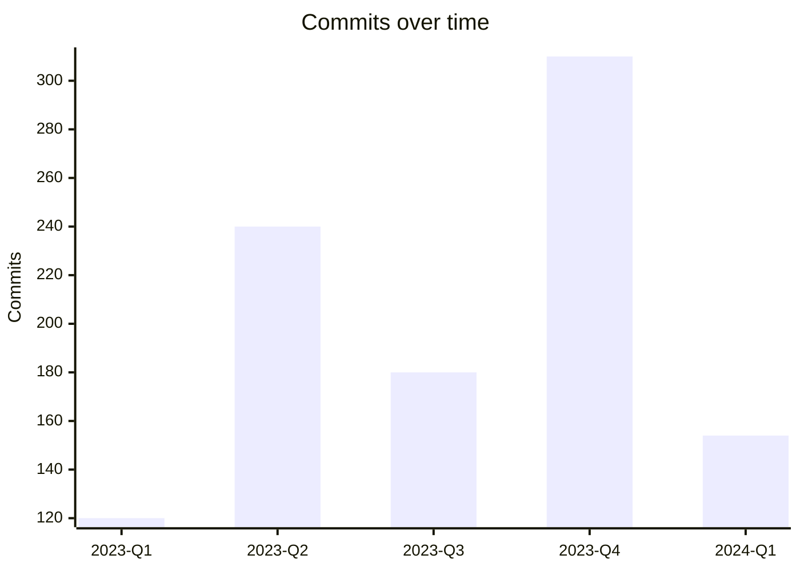

commit-whisper TEMPLATE-MARKDOWN
=============================

The **composition** spec for the Markdown report — the diff-able, PR/wiki-reviewable
rendering. Same narrative-first spine as the HTML report, translated to a heading hierarchy
and text-only visuals that survive a `git diff` and render on common Markdown viewers. Epic 4
(Rich Rendered Reports) implements to this spec.

Sources
-------

- PRD FR-7 (degrade visuals per format — Markdown), FR-8 (narrative + per-metric explanations), FR-12 (Report JSON), FR-13 (render formats).
- EXPERIENCE.md — Markdown report row, Component Patterns (Coaching report, Metric section).
- TEMPLATE-HTML.md — band order and the visual-by-shape model this format degrades.
- Architecture I2 — Markdown via typed template literals; text tables + ASCII sparklines + Mermaid.

Governing constraints
---------------------

- **No binary/embedded images.** Every visual is text: ASCII sparklines, small text-bar
  tables, or **Mermaid** diagrams (rendered natively by GitHub/GitLab/common viewers; shown
  as fenced code where unsupported).
- **Diff-able.** The file must read cleanly in a `git diff` and a narrow PR column — so prose
  is the spine, tables are used sparingly, and the per-metric facets are **bullets, not wide
  tables**.
- **Self-complete single file.** When `markdown` is selected (possibly alongside other
  formats), it stands alone — all narrative, metrics, and coaching present; no companion
  assets. Multi-select writes `commit-whisper-report.md` beside any other selected outputs.
- **Same facts as every format** (derived from the one Report JSON) — Markdown never
  disagrees with HTML/Terminal/JSON. The JSON's two subtrees map straight in: the
  **`analysis`** subtree (metric values + status) feeds each metric's heading band and visual,
  and the **`narrative`** subtree feeds Summary / Explanation / Coaching and each metric's
  four-facet bullets via `narrative.explanations[<metricId>]`, joined by metric id. When the
  `narrative` subtree is absent (a fail-open degrade or an intentional `--no-ai` metrics-only
  run), only the `analysis` half renders — see "Degraded render" below.
- **All cards always shown — the static-format degradation of HTML's progressive disclosure.**
  HTML collapses healthy (`ok`) cards behind a control; a diff-able text document cannot
  collapse, so — exactly like no-JS HTML — every metric renders in full. Calm at ~30 metrics is
  held instead by the narrative-first spine, the prose-over-tables rule, and bullets, not by
  hiding anything.

Document skeleton
-----------------

Narrative first (Summary → Explanation → Coaching), metrics second — matching the HTML band
order, expressed as heading levels.

````markdown
# commit-whisper — <repo>

`<branch>` · <N> commits · <contributors> contributors · analyzed <date>
**Confidence:** <high|medium|low> · **<tier>** — <Free: "100 of N commits analyzed">

## Summary

> The repo's story in 2–3 sentences. (AI Narrative, pt.1)

## Explanation

Plain-language interpretation of what the metrics show and why. (pt.2)

## Coaching

### 1. <Themed chapter title>

- Prioritized, prescriptive step…
- …

### 2. <Themed chapter title>

- …

_Closing summary: the top priorities in recommended order._

## Metrics

### A · Activity & Cadence

How the project moves over time.



#### Commit volume over time  ● ok  `▁▂▄█▆▃▂`

- **Value** — 1,204 commits over 38 months
- **What it means** — …
- **Strengths** — …
- **Needs improvement** — …
- **Suggestions** — …

#### Bus factor  ▲ risk  **2**

- **Value** — 2 (pure scalar; no chart)
- **What it means** — …
- **Strengths** — —
- **Needs improvement** — …
- **Suggestions** — …
````

### Confidence & cap line

Directly under the title: `**Confidence:** …` and, on Free runs, the explicit
`<tier> — 100 of N commits analyzed`. Never buried. Confidence is carried by the **word**
(`high` / `medium` / `low`), never a glyph — the `●◐▲○` shapes are reserved for per-metric
health bands, so the two scales stay distinct (and color, which never survives a diff, is
never the signal).

### Coaching

The structured report (FR-8): an intro paragraph, **themed chapters as `###` headings** with
prioritized steps as bullets, and an italic **closing summary** of top priorities. Chapter
headings double as anchors for in-doc links.

### Metric groups (`###`) and metrics (`####`)

Each group is a `###` heading + a one-line description + its **group overview as a Mermaid
diagram**, then each metric as a `####` heading carrying its **status band** (`●` ok · `◐`
watch · `▲` risk · greyed `○` n/a — shape, not color, since color never survives a plain-text
diff; derived at render from the PRD §4.2 thresholds, exactly as in HTML), its inline visual,
and the four-facet bullets.

Showpiece vs substrate (the hero requires the narrative subtree)
----------------------------------------------------------------

Same contract as the HTML report: the narrated **showpiece** is bound to the `narrative` subtree
by construction. `## Summary`, `## Explanation`, `## Coaching`, and the per-metric four-facet
bullets render *only* when `narrative` is present. Without it the document is the **substrate** —
the `## Metrics` half rendered in full from `analysis` (group Mermaid / text-bar overviews,
per-metric sparklines / text-bars, values, and the shape-derived health bands), with the
narrative half absent. The substrate is a plainer functional document and **cannot masquerade as
the narrated hero**: in a `git diff` the missing `## Summary` / `## Explanation` / `## Coaching`
headings are conspicuous by their absence.

Degraded render (narrative unavailable)
---------------------------------------

When narration, grounding, or the provider fails *after* the metrics are computed, the Markdown
report **fails open** to the substrate and must read as **visibly wounded**. Because color never
survives a diff, the wound is carried by **structure and words**: a banner blockquote at the very
top of the file (above the `# commit-whisper — <repo>` title), and the narrative headings reduced to
stubs that name the gap.

````markdown
> ⚠ **Narrative unavailable — showing raw analysis.** The AI narration step failed; your
> metrics below are intact. _Retry · check the provider · switch it in Settings._

# commit-whisper — payments-api

`main` · 1,204 commits · 87 contributors · analyzed 2026-06-12
**Confidence:** —  _(no narrative to assess)_

## Summary

_Narrative unavailable — showing raw analysis._

## Explanation

_Narrative unavailable._

## Coaching

_Narrative unavailable._

## Metrics

### A · Activity & Cadence
… every group and metric renders in full from `analysis` …
````

- The **banner blockquote** is the first line in the file, so it survives a truncated preview and
  leads every reader; it carries the one actionable line.
- The **narrative sections stay as stub headings** (rather than being deleted) so the *shape* of
  what's missing is obvious in a `git diff`, and the **per-metric four-facet bullets are absent** —
  each `####` metric keeps its heading, status band, and inline visual, but the *What it means /
  Strengths / Needs improvement / Suggestions* bullets are gone.
- **Confidence** shows `—` (nothing to assess); the cap line, the `## Metrics` tree, and every
  health band still render from `analysis`.
- The run exits on a **distinct degraded exit code (see architecture exit-code enum)**.

**Degraded vs metrics-only.** Identical substrate, opposite framing. A `--no-ai` metrics-only run
*chose* to skip the narrative: **no banner blockquote**, no stub-heading alarm — just one quiet
footer line (`_Narrative skipped (--no-ai) — run interactively or add a key for the full
report._`) and a clean exit. The degraded render *broke* and shouts; the metrics-only render is
calm by design. Don't let them read alike.

Visual-by-shape (text degradation of the HTML model)
----------------------------------------------------

| Shape | HTML visual | Markdown equivalent |
| --- | --- | --- |
| Group overview | Chart.js signature chart | **Mermaid** diagram (`xychart-beta`, `pie`, `timeline`, etc.) |
| Per-metric time-series | small line/area chart | **ASCII sparkline** beside the metric heading (`▁▂▄█▆▃`) |
| Per-metric distribution | small bar/histogram | small **text-bar table** (e.g. `alice ███████ 41%`) |
| Scalar within a range | sparkline / mini-gauge | sparkline + the number, or `7/10` |
| Pure scalar | bold stat | the **bold number** in the metric heading + Value bullet |

Group-overview Mermaid mapping (degradation of the HTML chart table):

| Group | Mermaid form |
| --- | --- |
| A — Activity & Cadence | `xychart-beta` line/bar of commits & churn over time |
| B — Contribution & Ownership | text-bar table (Pareto) + a bus-factor line of prose |
| C — Commit Message Quality | `pie` or stacked text-bar of message-quality categories |
| D — Branching & Merge Structure | `timeline` or `gitGraph` of merge structure |
| E — Code Churn & Hotspots | ranked text-bar table of hotspots + sparkline churn trend |
| F — Repository Health Signals | text-bar of component sub-scores + overall score `NN/100` |

Where a Mermaid form is awkward (e.g. a true radar), prefer a **text-bar table** — it renders
everywhere and stays diff-able. Mermaid is used where it genuinely reads better than text.

Per-metric facets — bullets, not tables
----------------------------------------

The four facets render as **bold-label bullets** (`- **What it means** — …`), in the fixed
order *Value · What it means · Strengths · Needs improvement · Suggestions*. Rationale: wide
2-column tables wrap badly in narrow PR/diff views, and diff-ability is this format's whole
reason to exist. **Implementers: never render the per-metric facets as a wide table** —
bullets are the contract here; a 2-column facet table that wraps in a PR diff defeats the only
reason this format exists. A `not_available` metric still gets its `####` heading and bullets,
with the reason stated under *What it means* and the visual omitted.

Manager-facing content (Group F, bus factor) stays **team-level**, never per-developer
ranking — identical constraint to every format.

Footer
------

```markdown
---
Generated by commit-whisper v<version> · schemaVersion 1.0.0 · <provider>/<model> · <timestamp>
<Free tier only:> _Support: Buy Me a Coffee — <link>_
```

The Buy Me a Coffee line appears only on the Free tier.

Accessibility & portability
---------------------------

- Pure text — fully screen-reader legible; sparklines and text-bars are always accompanied by
  the numeric value in prose (never glyph-only meaning).
- Each metric's health band is shown by **shape and word, never color**: `●` ok, `◐` watch,
  `▲` risk, greyed `○` n/a (color never survives a plain-text diff, so shape carries it).
- Renders with no network, no server, no binary assets.
- On viewers without Mermaid support, the fenced ```` ```mermaid ```` block shows its source;
  the per-metric sparklines/tables remain legible regardless, so no metric data is lost.

Open deltas
-----------

None unique to this format. Markdown **degrades** the HTML model rather than adding new
requirements; it inherits the per-metric-visual delta already flagged in TEMPLATE-HTML.md
(FR-6/FR-13 reconciliation). The per-metric sparklines/text-bars here are the text expression
of that same decision. It likewise inherits the **degraded / substrate render** delta from
TEMPLATE-HTML.md (the locked fail-open + metrics-only decision); the banner here is a text
blockquote rather than a colored band, but the distinct degraded exit code remains owned by the
architecture exit-code enum (→ Winston), not invented in this format.
